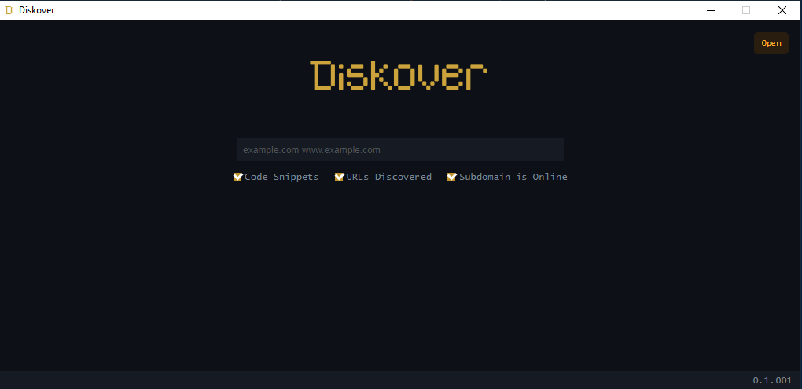
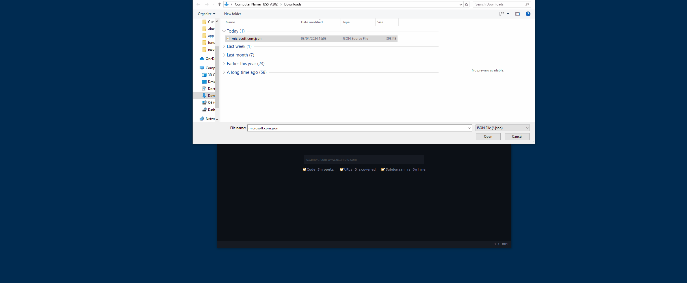

# Diskover

**Diskover** is an open-source tool designed for OSINT purposes. It empowers users to conduct reconnaissance activities on a target domain, providing insights such as subdomain enumeration, DNS lookup, code snippets related to the domain, IP history, and more. Equips you with the means to gather valuable information about a target domain efficiently.

## Features

### Subdomain Enumeration
Discover subdomains associated with the target domain, enabling comprehensive reconnaissance.

### DNS Lookup
Perform DNS lookups for the target domain, retrieving essential information like IP addresses, mail servers, and more.

### Code Snippets
Retrieve code snippets related to the target domain.

### IP History
Access the IP history of the target domain, uncovering its past associations and potential changes over time.

### And More...
Continues to evolve with additional features and enhancements.

> It's important to note that you can activate or deactivate the analysis of code snippets, discovered URLs, and subdomains. However, enabling these capabilities for certain domains may significantly increase the time required for analysis.

## Installation

There are two ways to run/install and run Diskover:

### Option 1: Using the Executable

You can download the pre-built executable file from the releases section of the repository. Simply download the `.exe` file corresponding to your operating system and run it on your machine.

### Option 2: Using the Source Code

Alternatively, if you want to run it on macOS or Linux, you can clone the repository. As there are no releases for these operating systems, this method will allow you to run Diskover on them:

1. Clone this repository `git clone https://github.com/0xAndre/diskover.git`.
2. Navigate to the project directory `cd diskover`.
3. Run `npm install` to install dependencies.
4. Execute `npm start` to launch the tool.

## Usage

Once is up and running, access it through your preferred web browser. Enter the target domain in the provided input field and select the desired functionalities to begin the reconnaissance process. Will then compile and present the gathered information for your analysis.

## Exporting and Importing Sessions

Offers the capability to export and import scanning sessions. This feature allows you to save your current scanning state and resume it later or transfer it to another system for further analysis.

## Contributions

Contributions are welcome! Whether you'd like to report a bug, suggest a feature, or contribute code improvements, feel free to submit a pull request or open an issue.

Happy diskovering! 🕵️‍♂️🔍
